# Quality Validation — AI Discovery Files System

> **Research Date**: April 2026
> **Purpose**: Analyze implementation gaps and provide actionable recommendations
> **Scope**: All 10 AI Discovery File types

---

## 1. Executive Summary

Our AI Discovery Files implementation has low compliance with official specifications. More than half of files fail to match their canonical requirements. The root causes sit at three levels: templates deviate from specs, the generator lacks structured data input, and the validator checks against the wrong reference.

### Key findings

- **7 files at critical severity** — `robots-ai.txt`, `ai.json`, `developer-ai.txt`, and others
- **3 root causes** identified: square-bracket syntax mismatch, spurious Canonical Block, wrong file purposes
- **2 engine-level gaps** — no Schema.org extraction, sequential generation

### Compliance by file

| File | Priority |
|------|:--------:|
| `llm.txt` | Moderate |
| `faq-ai.txt` | Moderate |
| `llms.html` | Critical |
| `llms.txt` | Moderate |
| `brand.txt` | Critical |
| `ai.txt` | Critical |
| `ai.json` | Critical |
| `developer-ai.txt` | Critical |
| `identity.json` | Critical |
| `robots-ai.txt` | Critical |

---

## 2. Three-Level Gap

The system has gaps cascading across three layers. Fixing one layer alone is insufficient.

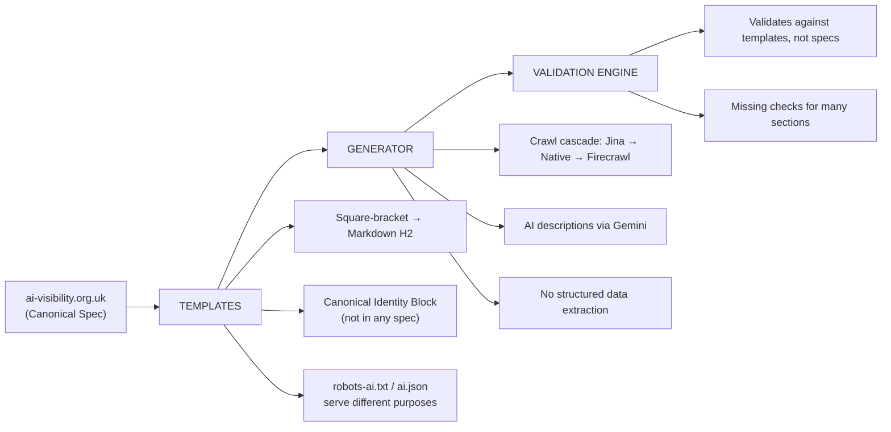

### Root Cause 1 — Square-Bracket Syntax

Official specs use INI-style `[section]` headers. Templates use Markdown `## Heading` syntax instead. This affects 5 of 10 files.

**Spec (brand.txt):**
```markdown
[official-names]
365i, 365i Ltd, Three Six Five Eye

[incorrect-names]
365I (uppercase I), 365-i (hyphen), 3-6-5-i (spelled out)
```

**Template output:**
```markdown
## Brand Name Usage
365i, 365i Ltd, Three Six Five Eye

## Terms to Avoid
365I, 365-i, 3-6-5-i
```

The spec's `[official-names]` section is **required**. The template uses a descriptive heading instead. A validator checking against the spec will report a missing section.

### Root Cause 2 — Canonical Identity Block

Every template prepends a Markdown table block that does not appear in any official specification:

```markdown
### Canonical Identity Block
| Field         | Value       |
|---------------|-------------|
| Business name | Acme Corp   |
| URL           | https://acme.com |
| Services      | Cloud computing |
```

This block appears in 9 of 10 templates (all except `llm.txt`, which starts directly with H1). It conflicts with `llms.txt`, which requires H1 to be the first content element — the block precedes it. For most other files, it simply adds noise without spec backing.

### Root Cause 3 — Wrong File Purposes

Two files serve completely different purposes than their specs define.

**`robots-ai.txt`** — The spec defines crawler access directives (`User-agent:`, `Allow:`, `Disallow:`). The template uses Markdown headings with informational content. An AI crawler expecting directives finds prose.

**`ai.json`** — The spec defines permissions and restrictions arrays. The template generates a canonical identity block structure. The output answers a different question than the spec asks.

---

## 3. System Architecture

Understanding the generation pipeline clarifies where each gap lives and how fixes cascade.

### 3.1 Generation Pipeline

The system has two distinct generation paths. Both share the same `crawlWebsite()` function but diverge after that.

**Legacy Path** — `generateLlmsTxt()`:

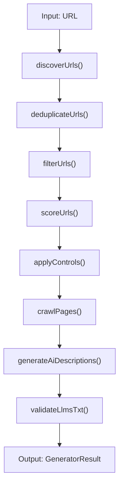

**Template-Based Path** — `generateFile()` / `generateAllMissing()`:

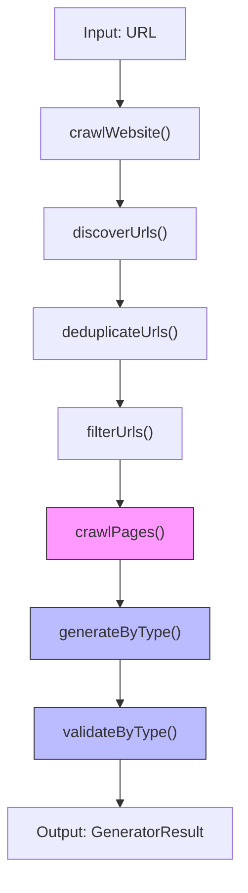

> **Note:** The template-based path calls `crawlWebsite()` directly, which does **not** call `scoreUrls()` or `applyControls()`. All URLs are assigned score=0 and pass through without scoring/filtering. The legacy path applies full scoring and control logic. This is a gap: the primary path (template-based) lacks URL prioritization.

### 3.2 Fetch Cascade

Each URL falls through a three-step cascade. The critical detail: only **Native Fetch** preserves JSON-LD intact. Jina strips all HTML. Firecrawl may strip it.

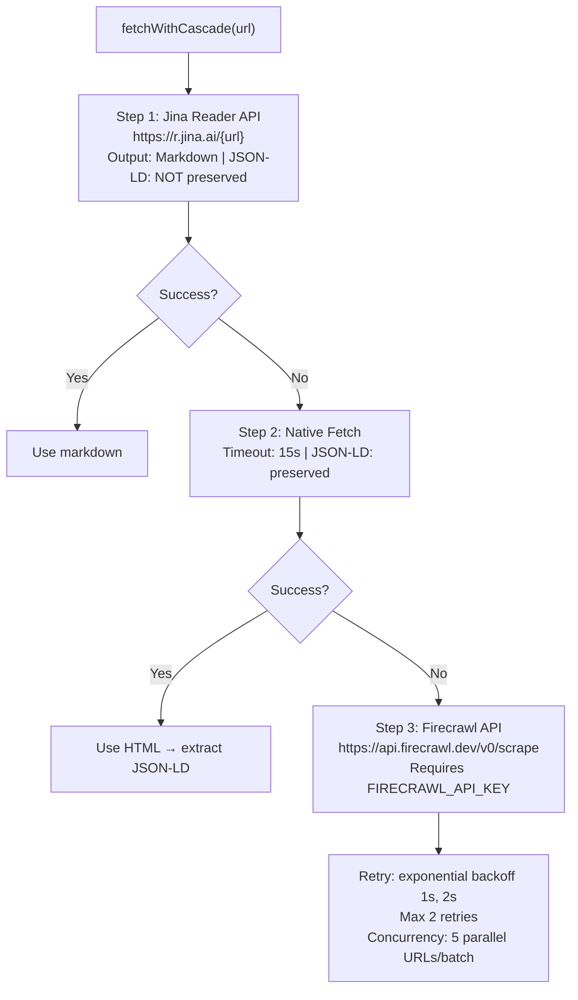

### 3.3 Two Generation Paths

The system has two generation paths:

**Legacy Path** — `generateLlmsTxt()`: crawls, builds llms.txt from structured data, validates. Single file only.

**Template-Based Path** — `generateFile()`: crawls once, routes each file type to a specialized generator. Supports all 10 file types. This is the primary path.

| File Type | Generator |
|-----------|-----------|
| `llms.txt` | `buildLlmsTxt()` (structured) |
| `brand.txt`, `faq-ai.txt`, `llm.txt`, `ai.txt`, `developer-ai.txt`, `robots-ai.txt`, `llms.html` | Gemini-powered |
| `identity.json`, `ai.json` | Gemini + placeholder fallback |

### 3.4 Gemini Template Filling

When Gemini is used, the pipeline is:

1. **Build crawl context** — Format crawled pages, site name, brand name, existing llms.txt, FAQs into a structured string.
2. **Build prompt** — Combine context with file-type-specific instructions.
3. **Call Gemini** — Cascade: `gemini-3-flash-preview` → `gemini-2.5-flash` → `gemini-3.1-pro-preview` → `gemini-2.5-pro`, rotating API keys on quota errors.
4. **Fallback** — JSON files fall back to placeholder replacement (`{{placeholder}}` → crawled data or `"N/A"`). Text files throw a structured error.

### 3.5 Redundant Crawling

**`generateFile()`** starts with `crawlWebsite()` on every call. Generating 5 different files crawls the website 5 times.

```
await generateFile("brand.txt", "https://example.com")  // Crawl 1
await generateFile("faq-ai.txt", "https://example.com")  // Crawl 2
await generateFile("identity.json", "https://example.com") // Crawl 3
```

**`generateAllMissing()`** calls `crawlWebsite()` once, then reuses the data. But generation still runs sequentially in a `for` loop.

| Entry point | Crawls | Generation |
|-------------|:------:|:----------:|
| `generateFile()` × N | N | N/A |
| `generateAllMissing()` | 1 | Sequential |

---

## 4. Per-File Analysis

Each file deviates from its spec in one of three ways: missing required sections, wrong section syntax, or serving an entirely different purpose. The sections below group all 10 files accordingly.

### 4.1 Spec-Compliant Files

These files match their specs closely. The gaps are minor.

**`llm.txt`** — The strongest file. The spec says it should redirect (301) to llms.txt, and the template generates a file that links to it. The only gap: the spec recommends the same content as llms.txt, but this is not enforced.

**`faq-ai.txt`** — Best-aligned file overall. Uses `Q:` / `A:` prefix format correctly. Remaining gaps: the `URL:` attribution (required by v2.0) and the Canonical Identity Block preamble.

### 4.2 Files Missing Required Sections

These files use Markdown headings instead of the required square-bracket INI syntax. All sections exist in concept but are labeled differently.

**`brand.txt`** — Most structural gaps. The spec requires `[official-names]`, `[incorrect-names]`, and `[naming-rules]`. The template uses `## Brand Name Usage`, `## Terms to Avoid`, and custom sections.

| Aspect | Spec | Template | Gap |
|--------|------|----------|-----|
| `[official-names]` | Required | `## Brand Name Usage` | CRITICAL |
| `[incorrect-names]` | Required | `## Terms to Avoid` | CRITICAL |
| `[naming-rules]` | Required | Custom sections | CRITICAL |
| Square-bracket syntax | Required | Not used | CRITICAL |

**`ai.txt`** — Missing two critical sections entirely.

| Aspect | Spec | Template | Gap |
|--------|------|----------|-----|
| `[permissions]` section | Required | Missing | CRITICAL |
| `[restrictions]` section | Required | Missing | CRITICAL |
| Square-bracket syntax | Required | Not used | CRITICAL |

**Fix**: Add `[permissions]` and `[restrictions]` sections with square-bracket syntax. Consider supporting both Markdown headings and square brackets for backward compatibility.

**`developer-ai.txt`** — Missing the API status field and uses wrong section names.

| Aspect | Spec | Template | Gap |
|--------|------|----------|-----|
| `[overview]` | Required | `## Technical Overview` | CRITICAL |
| `[public-api]` with status | Required | Missing | CRITICAL |
| `[public-areas]` | Required | `## Public Pages` | CRITICAL |
| Square-bracket syntax | Required | Not used | CRITICAL |

### 4.3 Files Serving Wrong Purposes

These files generate content that answers a completely different question than their specs define.

**`robots-ai.txt`** — The worst-performing file. The spec defines crawler access directives:

```markdown
User-Agent: ClaudeBot
Allow-Training: no
Allow-Retrieval: yes
Allow-Citation: yes

User-Agent: *
Disallow-Training: /
```

The template generates Markdown headings with informational content. The output cannot control crawler behavior because it does not use directive syntax.

**`ai.json`** — The spec defines permissions and restrictions arrays. The template generates a canonical identity block:

```json
{
  "canonicalIdentityBlock": "Business name: {{legal-name}}\nPublic brand name...",
  "businessIdentity": { ... },
  "services": { ... }
}
```

Missing: top-level `name`, `url`, `permissions[]`, `restrictions[]`.

### 4.4 JSON Files with Minor Issues

**`identity.json`** — Three distinct problems:

1. **Wrong `$schema` URL** — template uses `https://www.365i.co.uk/...` instead of `ai-visibility.org.uk`. Confirmed at line 2 of the template.
2. **Non-spec custom fields** — Fields like `industry`, `naicsCode`, `identifier`, `foundingLocation`, `headquarters`, `services`, `founder`, `metadata` are present. Whether they match the spec depends on the current v1.1.1 spec definition.
3. **The `name` field is present** — contrary to earlier claims in this document. The scanner's `has_name` check expects it and the template provides it.

**`llms.html`** — Two issues:

1. **Missing `<link rel="canonical">` to llms.txt** — Confirmed. No such link tag exists in the template.
2. **Uses `index,follow` instead of `noindex`** — Line 6: `<meta name="robots" content="index,follow">`. Should be `noindex,follow`.

Additionally, the scanner (`validateLlmsHtml`) does not emit errors for these items. The checklist marks items as "passed" whenever the file is present with no errors — a silent false positive.

---

## 5. Generator Pipeline

The current pipeline is a simple sequence. The improved pipeline adds a **semantic enrichment layer** between crawling and generation.

> **Status: Planned** — Section 5 is a blueprint. The semantic enrichment layer (`extractStructuredData`, `mergePageSignals`, `generateAiDescriptions`) and `CrawlManager` are not yet implemented in `src/lib/generator/crawler.ts`. Current code only does cascade fetch + markdown metadata extraction.

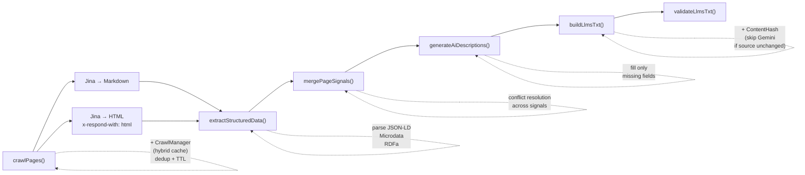

> **Note on HTTP requests:** For each priority page, `extractStructuredData()` requires **2 requests** to Jina Reader:
> 1. Default request → Markdown content
> 2. With `x-respond-with: html` header → raw HTML (needed for JSON-LD parsing)
>
> This is not a single request — Jina Reader does not return both HTML and Markdown in one response. Priority pages get 2 requests; non-priority pages get 1 (markdown only).

### 5.1 CrawlManager — Fix Redundant Crawling

> **Status: Planned** — Not yet implemented.

The `generateFile()` function recrawls on every call. The fix is a module-level `CrawlManager` singleton with a two-tier storage strategy.

#### Storage Strategy (Hybrid: Memory + Disk)

- **Memory Map** — hot path, sub-ms read/write
- **Disk JSON file** (`.cache/crawl-cache.json`) — persistence, restore on memory miss
- **TTL** from env var `CRAWL_CACHE_TTL_MS` (default: `5 * 60 * 1000` = 5 phút, matches Jina's own cache TTL)

```typescript
type CacheEntry<T> = {
  data: T;
  timestamp: number;  // when cached
  etag?: string;      // optional, for conditional fetch
};

type CrawlCache = Map<string, CacheEntry<CrawlResult>>;
```

#### Core Logic — `getOrCrawl()`

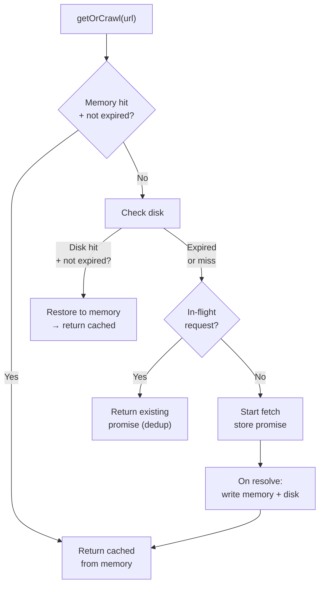

**Design decisions:**
- **Deduplicate in-flight**: if 10 files request the same URL concurrently, only 1 HTTP request fires — the other 9 share the same Promise
- **Async disk I/O**: `fs.promises` does not block the event loop
- **Lazy init**: disk cache reads on-demand, not on startup
- **Error resilience**: disk write failure → warn + continue (memory-only fallback)

**Env vars:**

```bash
CRAWL_CACHE_TTL_MS=300000      # default 5 phút
CRAWL_CACHE_DIR=.cache         # disk cache directory
CRAWL_CACHE_ENABLED=true       # toggle to disable cache
```

**Result**: `generateFile("brand.txt")` × 10 calls = 1 crawl + 9 cache hits. Customers can choose any file individually without performance penalty.

### 5.2 Semantic Enrichment Layer

> **Status: Planned** — Not yet implemented. Current `crawler.ts` only extracts metadata from markdown (title, H1, description). This layer adds JSON-LD parsing, signal merging, and schema-first generation.

This layer converts raw crawled pages into structured, conflict-resolved data before generation. It has three stages.

#### 5.2.1 `extractStructuredData()`

Parse structured data from HTML source, in priority order:

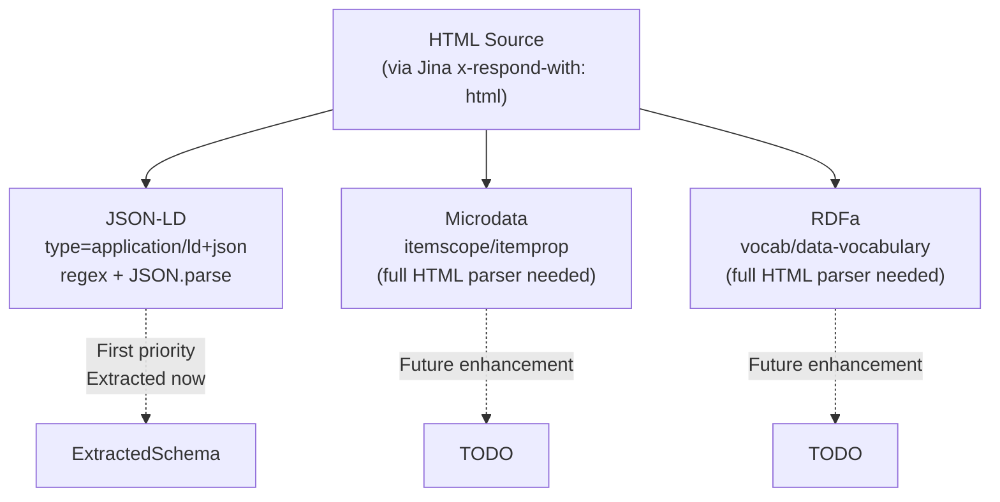

> **Input:** HTML source comes from a **separate Jina request** with header `x-respond-with: html` (not from the markdown request). HTML is needed because JSON-LD lives in `<script type="application/ld+json">` tags that are stripped during markdown conversion.

```typescript
type ExtractedSchema = {
  organization?: OrganizationSchema;
  faqPage?: FAQPageSchema;       // direct source for faq-ai.txt
  website?: WebSiteSchema;
  products?: ProductSchema[];
  rawJsonLd: unknown[];           // all parsed entities for debugging
};

type PageStructuredData = {
  url: string;
  schema: ExtractedSchema;
  canonical?: string;
  title?: string;
  metaDescription?: string;
};
```

**FAQPage extraction is high-value.** FAQPage schema bypasses Gemini entirely for `faq-ai.txt` — 100% source accuracy with zero hallucination risk.

#### 5.2.2 `mergePageSignals()`

Merge signals from multiple sources into a single authoritative record per page, then merge across pages.

**Per-page merge** — canonical URL wins (site owner's declared intent):

| Signal | Authority | Note |
|--------|:---------:|------|
| `canonical` URL | Highest | Site owner's declared intent |
| Schema.org `url` | High | Structured, machine-readable |
| `<title>` tag | Medium | Editor's summary |
| Meta description | Medium | Designed for snippets |
| H1 heading | Medium | Page author's intent |
| Visible content | Lowest | Raw, unstructured |

**Cross-page merge**:

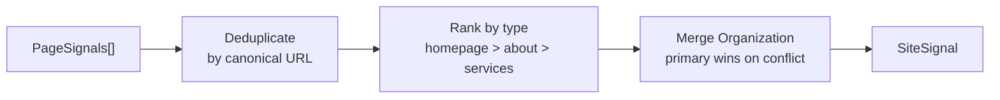

**Token budget:** Each page distill to 200-500 tokens. Full site output stays under 5k tokens.

#### 5.2.3 `generateAiDescriptions()`

Only fill missing fields. Schema fields are used first; Gemini is called only when schema lacks the information.

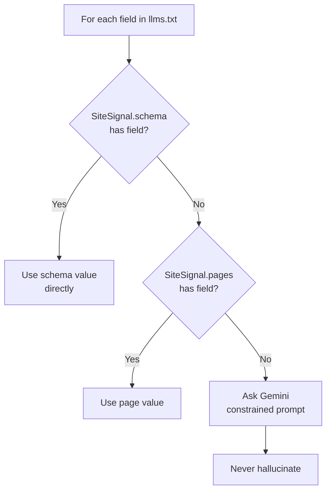

**Constraint:** Gemini never invents information. It only reformulates what exists in schema or page content.

### 5.3 Parallel Generation + Error Isolation

> **Status: Planned** — Not yet implemented.

After enrichment, all independent files generate simultaneously. Wrap with `Promise.allSettled()` so one failure does not block others.

```typescript
const results = await Promise.allSettled(
  fileTypes.map(ft => generateByType(ft, enrichedSiteSignal))
);
```

**Result**: Generating 10 files at 5 seconds each sequentially takes 50 seconds. With `Promise.allSettled()`, it takes ~5 seconds.

### 5.4 Content Hash Tracking — Skip Regeneration

> **Status: Planned** — Not yet implemented.

Store the SHA-256 hash of crawled page content. Before generating, compare the new hash against the stored hash. If unchanged, skip the Gemini call entirely.

**Storage:** `.cache/content-hashes.json` — persisted across sessions (disk-based, not in-memory — hash needs to survive process restarts)

**Logic:**

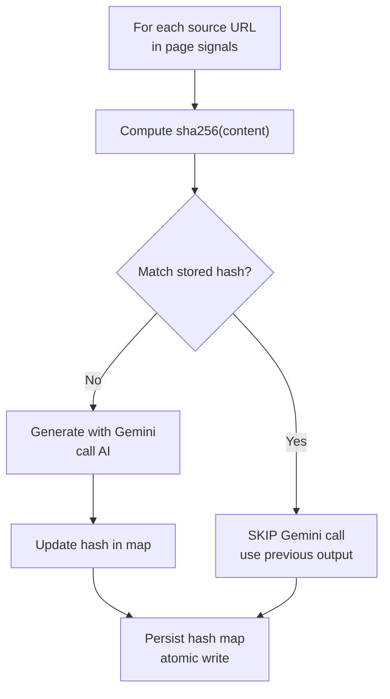

**Design decisions:**

- **Skip Gemini on hash match** — full Gemini call is bypassed, saving tokens and ~2-5s latency per file
- **Atomic write** — write to temp file then rename to prevent corruption if process crashes mid-write
- **Graceful degradation** — if hash file is corrupt or missing, regenerate all (no break, no error)
- **Per-URL tracking** — hash is keyed by source URL, not by output file (same content from different URLs = different entries)

**Env vars:**

```bash
CONTENT_HASH_ENABLED=true
CONTENT_HASH_DIR=.cache
```

**Result:** Generating `brand.txt`, `llms.txt`, and `faq-ai.txt` for a site whose homepage hasn't changed since last run = 0 Gemini calls, ~200ms total.

---

## 6. Schema.org Integration

JSON-LD sits inside `<script type="application/ld+json">` tags in raw HTML. The Jina reader default output is markdown — it strips HTML tags including JSON-LD scripts. For schema extraction, we use Jina's `x-respond-with: html` header to get raw HTML. This section explains how we get HTML and map schemas to output files.

### 6.1 How We Get HTML for Schema Extraction

> **Note:** Jina Reader supports `x-respond-with: html` which returns `documentElement.outerHTML` (raw HTML). This eliminates the need for a separate `fetchNative()` call. However, this is still **2 requests** to Jina per priority page — one for markdown (default) and one for HTML — not 1.

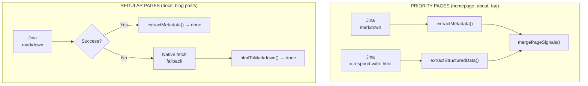

**Priority pages** get 2 Jina requests: one for markdown (metadata extraction) and one with `x-respond-with: html` (JSON-LD extraction). If HTML request fails, schema extraction is skipped — Gemini fills the gap.

**Regular pages** use Jina markdown only. Native fetch is a fallback only if Jina fails entirely.

Schema extraction runs after `crawlPages()` and feeds `mergePageSignals()` with structured data.

### 6.2 JSON-LD Extraction

The simplest extraction method is regex + `JSON.parse`. No full HTML parser needed.

```
Regex: /<script[^>]*type=["']application\/ld\+json["'][^>]*>([\s\S]*?)<\/script>/gi
Parse: JSON.parse(match[1])
Normalize: Flatten @graph arrays into individual entities
Select: Prefer Organization > LocalBusiness > WebSite
```

Many sites use Google's `@graph` pattern. Flatten it to individual entities and select the most complete one of each type.

### 6.3 Schema-to-File Mapping

#### `identity.json` ← Organization schema

| identity.json field | Schema.org source |
|--------------------|-------------------|
| `legalName` | `Organization.legalName` |
| `alternateName[]` | `Organization.alternateName[]` |
| `foundingDate` | `Organization.foundingDate` |
| `foundingLocation.*` | `Organization.foundingLocation.address*` |
| `headquarters.*` | `Organization.headquarters.*` |
| `contactPoints[].email` | `Organization.contactPoint[].email` |
| `contactPoints[].telephone` | `Organization.contactPoint[].telephone` |
| `areaServed[].name` | `Organization.areaServed[].name` |
| `sameAs[]` | `Organization.sameAs[]` |
| `numberOfEmployees` | `Organization.numberOfEmployees` |
| `founder.name` | `Organization.founder.name` |

#### `faq-ai.txt` ← FAQPage schema

Direct extraction. No Gemini needed. Accuracy is 100% from the source.câcâ

```json
{
  "@type": "FAQPage",
  "mainEntity": [
    {
      "@type": "Question",
      "name": "What services do you offer?",
      "acceptedAnswer": {
        "@type": "Answer",
        "text": "Emergency drainage repairs, CCTV surveys..."
      }
    }
  ]
}
```

### 6.4 Expected Impact

| File | Before | After (when schema present) |
|------|--------|----------------------------|
| `identity.json` | 40% — most fields = "N/A" | ~70-80% |
| `faq-ai.txt` | Gemini-inferred Q&A | Direct FAQPage extraction |
| `llms.txt` | Plain text from crawled content | Schema-enhanced context |
| `developer-ai.txt` | Generic content | Actual schema presence |

### 6.5 Fallback Behavior

Schema extraction is best-effort. It never breaks the pipeline.

**Priority pages (homepage, about, faq):**

| What happened | Result |
|---------------|--------|
| Jina HTML + Markdown succeeded | Extract JSON-LD from HTML, use markdown for content |
| Jina HTML failed, Markdown succeeded | Skip schema extraction, use Jina markdown |
| Jina Markdown failed, Native succeeded | Convert HTML to markdown, skip schema |
| All failed | Gemini infers everything |
| JSON-LD found but malformed | Skip that entity, continue |

**Regular pages (docs, blog):**

| What happened | Result |
|---------------|--------|
| Jina succeeded | Use Jina markdown, skip schema |
| Jina failed, Native succeeded | Convert HTML to markdown, skip schema |
| Both failed | Gemini infers everything |

**Key rule:** If no schema is found anywhere on the site, Gemini fills the gaps as before — nothing breaks.

---

## 7. Validation Engine

### 7.1 The Validator Problem

The project has two validators:

| File | Coverage |
|------|---------|
| `src/lib/validator.ts` | `llms.txt` only (legacy) |
| `src/lib/ai-discovery-scanner.ts` | All 10 file types |

Both validate against template structure, not against the official specs. A file can pass validation while being non-compliant with its specification.

**Example**: `faq-ai.txt` has perfect validation alignment — but the template itself deviates from the spec in ways the validator doesn't check (square-bracket syntax, URL attribution).

### 7.2 Missing Validation Rules

| File | Missing rules |
|------|--------------|
| `llms.txt` | `## Contact` section |
| `identity.json` | `type`, `description` fields not validated |
| `ai.json` | `permissions[]`, `restrictions[]`, `name`, `url` |
| `ai.txt` | `## Permissions`, `## Restrictions` |
| `brand.txt` | Correct/Incorrect usage sections |
| `llm.txt` | Content sync with llms.txt |
| `developer-ai.txt` | Technical overview, API information, public areas sections |
| `robots-ai.txt` | User-agent directives, content usage sections |
| `llms.html` | `canonical` link, `noindex` meta |

### 7.3 Validation Recommendations

- **Consolidate** the two validators into one. Validate against the official specification, not the template.
- **Add cross-file validation**: `llm.txt` should sync with `llms.txt`. `robots-ai.txt` should have actual directive syntax.
- **Add post-generation format checks**: After Gemini generates output, verify it matches the expected structure before returning it.

---

## 8. Priority Matrix

### P0 — Critical (Fix Immediately)

| File | Issue | Fix |
|------|-------|-----|
| `ai.json` | Serves wrong purpose | Rewrite to permissions/restrictions structure |
| `robots-ai.txt` | Serves wrong purpose | Rewrite to directive syntax |
| `identity.json` | Wrong `$schema` URL | Fix URL to `ai-visibility.org.uk` |
| `ai.txt` | Missing sections | Add `[permissions]` and `[restrictions]` |
| `llms.html` | Missing canonical link, wrong robots | Add `<link rel="canonical">`, change to `noindex` |
| Generator | Sequential generation | Replace `for` loop with `Promise.all()` |
| Generator | Redundant crawls | Add CrawlManager singleton with hybrid (memory + disk) TTL cache |
| Generator | No skip on unchanged content | Add ContentHash tracking — skip Gemini calls when source content hasn't changed |
| Validator | `identity.json` missing rules | Add `type` and `description` checks |
| Validator | `ai.json` missing rules | Add `permissions[]`, `restrictions[]`, `name`, `url` checks |

### P1 — High (Next Sprint)

| File | Issue | Fix |
|------|-------|-----|
| `brand.txt` | Missing sections | Add `[official-names]`, `[incorrect-names]`, `[naming-rules]` |
| `developer-ai.txt` | Missing sections | Add `[overview]`, `[public-api]` with status, `[public-areas]` |
| `llms.txt` | Spurious Canonical Block | Remove; spec uses only H1 + blockquote + sections |
| `faq-ai.txt` | Missing URL attribution | Add `URL:` attribution per v2.0 |
| Generator | Error isolation | Use `Promise.allSettled()` |
| Validator | `llms.txt` missing `## Contact` | Add validation rule |
| Validator | `ai.txt` missing section checks | Add `## Permissions`, `## Restrictions` rules |

### P2 — Medium

| File | Issue | Fix |
|------|-------|-----|
| Generator | Per-file retry | Continue other files if one fails Gemini |
| Generator | Output structure validation | Verify Gemini output matches template |
| Validator | `brand.txt` section checks | Add correct/incorrect usage rules |
| Validator | `developer-ai.txt` section checks | Add section completeness rules |
| Validator | `robots-ai.txt` directive checks | Add directive syntax rules |
| Validator | `llms.html` structure checks | Add canonical link, noindex rules |

### P3 — Semantic Enrichment (Pipeline section 5.2)

| Component | Action |
|-----------|--------|
| Schema extraction | `extractStructuredData()` after `crawlPages()` |
| Priority pages | Dual fetch (Jina + Native) for homepage and about page |
| FAQ direct extraction | `FAQPage` schema → `faq-ai.txt` directly |
| Conflict resolution | `mergePageSignals()` with signal authority ranking |
| Constrained generation | `generateAiDescriptions()` fills only missing fields |
