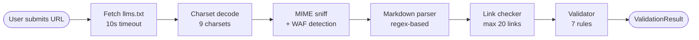

# llms.txt Checker

A lightweight, zero-dependency validator for [`llms.txt`](https://llmstxt.org) files — the machine-readable site summary specification for AI crawlers.

## The Problem

When AI models browse a website, they need a fast way to understand its structure and content. The `llms.txt` specification addresses this — a Markdown file at the domain root providing an AI-focused summary of the site.

Yet no tool exists to verify whether a site's `llms.txt` actually conforms to the specification. This project fills that gap: submit a URL, and receive a detailed report of errors, warnings, and improvement suggestions.

## Key Features

- **7 validation rules** — from required H1 title to optional broken link detection
- **9 charset support** — handles sites using UTF-8, GBK, Big5, EUC-KR, Shift_JIS, and more
- **WAF detection** — catches Cloudflare, Incapsula, PerimeterX challenge pages that masquerade as valid files
- **Async link checking** — validates up to 20 links per file with `Promise.allSettled`, 5s per link
- **Pure TypeScript business logic** — no UI coupling, fully testable engine in `src/lib/`
- **Graceful error mapping** — 12 distinct network error codes for precise diagnostics

## Quick Start

### Install and run

```bash
npm install
npm run dev
```

Open [http://localhost:3000](http://localhost:3000) and enter any URL to validate its `/llms.txt`.

### Validate via API

```bash
curl -X POST http://localhost:3000/api/validate \
  -H "Content-Type: application/json" \
  -d '{"url": "https://example.com"}'
```

## API Reference

### `POST /api/validate`

**Request body**

```json
{ "url": "https://example.com" }
```

**Response**

```typescript
{
  found: boolean;
  message?: string;
  errorCode?: ErrorCode;
  errors: ValidationError[];
  warnings: ValidationWarning[];
  content?: string;
  parsedData?: ParsedData;
  linkResults?: LinkResult[];
}
```

See [`src/lib/types.ts`](src/lib/types.ts) for full type definitions.

**Error codes**

| Code | When triggered |
|------|----------------|
| `not_found` | HTTP 404 — file does not exist |
| `access_denied` | HTTP 401 / 403 — authentication or permission required |
| `ssl_error` | SSL certificate expired or invalid |
| `redirect_loop` | Server redirects infinitely |
| `dns_error` | Domain does not resolve |
| `geo_blocked` | Access denied by geographic restrictions |
| `connection_error` | Connection refused or reset |
| `timeout` | Server did not respond within 10s |
| `server_error` | HTTP 5xx response |
| `not_llms_txt` | Content is HTML, WAF challenge, or non-text |
| `unsupported_encoding` | Charset declared by server is not supported |

## Validation Rules

### Required — errors if not met

| Rule | Trigger |
|------|---------|
| `markdown_format` | File is empty or contains no readable characters (`[a-zA-Z0-9]`) |
| `h1_title` | File is missing an H1 heading (`# Title`) |

### Optional — warnings if not met

| Rule | Trigger |
|------|---------|
| `quote_block` | File has no blockquote (brief project description) |
| `description_paragraphs` | No detailed paragraphs after the blockquote |
| `project_details` | Fewer than 2 H2+ headings AND fewer than 3 links |
| `file_list_format` | List entries don't match `- [Title](url)` or `- [Title](url): description` |
| `link_validation` | Any validated link returned a non-2xx HTTP status |

## Architecture

### Pipeline flow

The validation engine runs a three-stage pipeline. Each stage is isolated, testable, and has no knowledge of the others.



### Source structure

```
src/
├── app/
│   ├── api/
│   │   └── validate/
│   │       └── route.ts       # API entry point — orchestrates the pipeline
│   ├── page.tsx               # Landing page
│   ├── layout.tsx             # Root layout
│   └── results-page.tsx       # Results display page
├── components/
│   ├── validator-form.tsx     # URL input form
│   ├── result-tabs.tsx        # Tabs for errors/warnings/links
│   ├── validation-details-tab.tsx
│   ├── results-error-panel.tsx
│   ├── markdown-preview.tsx   # Rendered llms.txt preview
│   └── error-boundary.tsx     # React error boundary
└── lib/
    ├── types.ts               # Shared TypeScript interfaces
    ├── markdown-parser.ts     # Regex parser: H1, blockquote, links, headings
    ├── validator.ts           # 7-rule validation engine
    ├── validation-checklist.ts # UI state transformer for checks
    ├── content-sniffer.ts     # MIME whitelist + WAF/anti-bot detection
    ├── charset-decoder.ts     # Decode ArrayBuffer → string (9 charsets)
    └── network-error-mapper.ts # Network error → error code mapping
```

**Design principle:** All business logic lives in `src/lib/`. No React imports there — the validation engine can be tested and reused without any UI dependency.

### Key design decisions

| Decision | Reason |
|----------|--------|
| **Custom regex parser** | The `llms.txt` surface area is small (H1, blockquote, links, headings). A focused regex parser covers all of it with less code and no third-party dependency. |
| **`Promise.allSettled` for links** | All links are checked concurrently, with graceful degradation — a slow link never blocks others. |
| **20-link cap** | Prevents DoS: an attacker submitting a URL with thousands of links would exhaust server time and resources. |
| **MIME whitelist** | Only `text/plain`, `text/markdown`, and `application/octet-stream` pass. Everything else is rejected. Safer than a blacklist approach. |
| **WAF detection even on valid MIME** | Many WAFs return challenge pages with `Content-Type: text/plain` or no header. MIME sniffing alone would miss these. |
| **Separate timeouts** | Link check: 5s. Main fetch: 10s. Links are typically on familiar domains and don't need as long. |

## Deployment

### Local

```bash
npm run dev
```

### Vercel

```bash
npm install -g vercel
vercel
```

## Scripts

| Command | Description |
|---------|-------------|
| `npm run dev` | Start dev server on port 3000 |
| `npm run build` | Build for production |
| `npm run start` | Start production server |
| `npm run lint` | Run ESLint on `src/` |
| `npm run typecheck` | Run TypeScript type check |
| `npm test` | Run tests in watch mode |
| `npm run test:run` | Run tests once |

## Contributing

See [`CONTRIBUTING.md`](CONTRIBUTING.md) for setup instructions, test conventions, and code style guidelines.

## Changelog

See [`CHANGELOG.md`](CHANGELOG.md) for version history.

## License

MIT