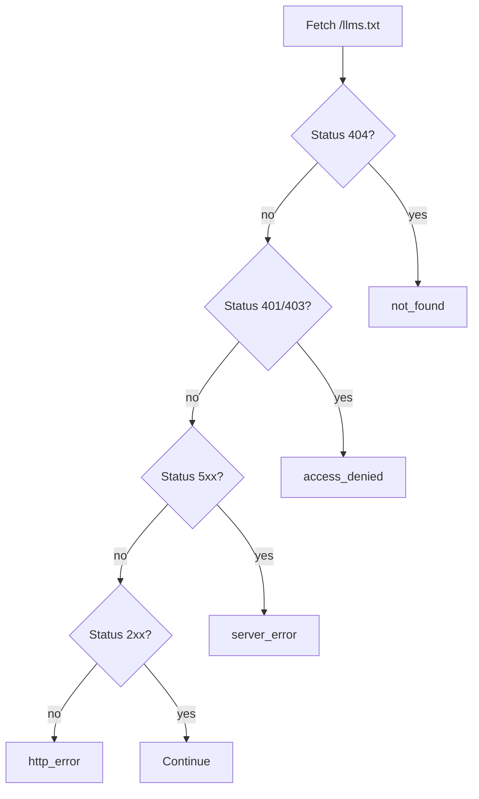

# llms.txt Specification Reference

This document describes the `llms.txt` file format and the validation rules enforced by this checker.

For implementation details, see [`src/lib/validator.ts`](src/lib/validator.ts). For type definitions, see [`src/lib/types.ts`](src/lib/types.ts).

---

## What is llms.txt?

`llms.txt` is a proposed standard (see [llmstxt.org](https://llmstxt.org)) for providing AI language models with a machine-readable summary of a website. It is a Markdown file placed at the root of a domain (`https://example.com/llms.txt`).

Unlike `robots.txt` which tells crawlers what to *skip*, `llms.txt` tells AI models what to *read*. It should contain:

- A clear title and one-line description of the site
- A list of key pages with descriptions
- Enough context for an AI to decide whether the site is relevant to a query

---

## Expected File Structure

A compliant `llms.txt` follows this structure:

```markdown
# Site Title

> One-line description of the site.

Optional paragraph describing the project in more detail.

## Section Name

- [Page Title](https://example.com/page)
- [Page Title](https://example.com/another): Description of this page

### Another Section

[More content...]
```

### Sections

| Section | Required | Description |
|---------|----------|-------------|
| H1 Title | **Yes** | The site or project name (`# Title`) |
| Blockquote | Recommended | One-line description (`> Description`) |
| Body paragraphs | Recommended | Longer context after the blockquote |
| H2+ headings | Recommended | At least 2 headings to structure content |
| Link list | Recommended | At least 3 links to key pages |

---

## Validation Rules

### Required — errors if violated

These rules must pass or the file is considered non-compliant.

#### `markdown_format`

The file must be non-empty and contain at least one readable character (`[a-zA-Z0-9]`).

**Fails when:**
- File is empty
- File contains only whitespace
- File has no alphanumeric characters

**Source:** [`src/lib/validator.ts`](src/lib/validator.ts) — Rule 1

---

#### `h1_title`

The file must contain a Markdown H1 heading: `# Title`.

**Fails when:**
- No line starts with `# ` (ignoring leading whitespace)
- The H1 is empty (`# `)

**Source:** [`src/lib/markdown-parser.ts`](src/lib/markdown-parser.ts) — H1 regex

---

### Optional — warnings if violated

These rules improve quality. A file can be valid without them, but should be aware of the tradeoff.

#### `quote_block`

The file should include a Markdown blockquote (`> text`) providing a brief project description.

**Fails when:**
- No lines start with `>` (ignoring leading whitespace)

**Source:** [`src/lib/validator.ts`](src/lib/validator.ts) — Rule 3

---

#### `description_paragraphs`

After the blockquote, there should be at least one paragraph of detailed description.

**Fails when:**
- Blockquote is present but no paragraphs follow it
- `parsedData.descriptions.length === 0`

**Source:** [`src/lib/validator.ts`](src/lib/validator.ts) — Rule 4

---

#### `project_details`

The file should contain sufficient project detail — either at least 2 H2+ headings OR at least 3 links.

**Fails when:**
- `headingCount < 2 AND links.length < 3`

**Source:** [`src/lib/validator.ts`](src/lib/validator.ts) — Rule 5

---

#### `file_list_format`

List entries should follow one of these formats:
- `- [Title](url)`
- `- [Title](url): description`

**Fails when:**
- A line starts with `-` but does not match `- [` pattern

**Source:** [`src/lib/validator.ts`](src/lib/validator.ts) — Rule 6

---

#### `link_validation`

All links in the file should return HTTP 2xx when checked.

**Fails when:**
- Any link in `linkResults` has `ok === false`

**Note:** Link checking is optional and only runs when `linkResults` is provided to the validator. Up to 20 links are checked, with a 5s timeout per link.

**Source:** [`src/lib/validator.ts`](src/lib/validator.ts) — Rule 7

---

## Error Codes

These describe why the checker could not fetch or parse the `llms.txt` file.

| Code | Trigger | Description |
|------|---------|-------------|
| `not_found` | HTTP 404 | File does not exist at `/llms.txt` |
| `access_denied` | HTTP 401 / 403 | Server requires authentication or denies access |
| `http_error` | Other 4xx | Miscellaneous HTTP client error |
| `server_error` | HTTP 5xx | Server-side failure |
| `connection_error` | Network | TCP connection refused or reset |
| `timeout` | Network | No response within 10 seconds |
| `ssl_error` | Network | SSL/TLS certificate expired, invalid, or untrusted |
| `redirect_loop` | Network | Server redirects infinitely |
| `dns_error` | Network | Domain name does not resolve |
| `geo_blocked` | Network | Access denied by geographic or regional restrictions |
| `not_llms_txt` | Content | File is HTML, PDF, JSON, or a WAF challenge page |
| `unsupported_encoding` | Content | Server declares a charset this tool does not support |

All network error mapping logic lives in [`src/lib/network-error-mapper.ts`](src/lib/network-error-mapper.ts).

---

## Content Validation Layers

Before any Markdown parsing occurs, the file goes through three content validation layers:

### 1. HTTP Status Check



### 2. Charset Decoding

The tool attempts to decode the response body using the declared `Content-Type` charset, or falls back to UTF-8. Supported charsets:

| Charset | Common use |
|---------|-----------|
| UTF-8 | Default, most modern sites |
| ISO-8859-1 | Legacy Western European |
| Windows-1252 | Legacy Windows Western |
| GBK | Chinese (Simplified) |
| GB2312 | Chinese (Simplified, older) |
| Big5 | Chinese (Traditional) |
| Shift_JIS | Japanese |
| EUC-KR | Korean |
| US-ASCII | ASCII-only fallback |

If the declared charset is not in this list, the tool returns `unsupported_encoding` instead of producing garbled text.

Implementation: [`src/lib/charset-decoder.ts`](src/lib/charset-decoder.ts)

### 3. MIME + WAF Sniffing

First, the `Content-Type` header is checked against a whitelist:

| Content-Type | Status |
|-------------|--------|
| `text/plain` | Allowed |
| `text/markdown` | Allowed |
| `application/octet-stream` | Allowed (fallback) |
| `text/html` | Rejected as `not_llms_txt` |
| `application/pdf` | Rejected as `not_llms_txt` |
| `application/json` | Rejected as `not_llms_txt` |
| `image/*`, `video/*`, `audio/*` | Rejected as `not_llms_txt` |

If no `Content-Type` is present, the first 2048 bytes are read to look for an HTML doctype (`<!DOCTYPE html>`, `<html>`). If found, the file is rejected as HTML.

Even when MIME is valid, the content is scanned for WAF and anti-bot signatures:

| Signature | Description |
|-----------|-------------|
| `__cf_chl_ctx` | Cloudflare challenge |
| `Incapsula` | Imperva Incapsula |
| `pXhr.withCredentials` | PerimeterX / Arachni |
| `meta robots noindex` | Bot detection via robots meta |
| Cloudflare headers | CF-Ray, CF-Cache-Tag |

If any of these are found, the file is rejected as `not_llms_txt` with an explanatory message.

Implementation: [`src/lib/content-sniffer.ts`](src/lib/content-sniffer.ts)

---

## Parser Output Schema

The Markdown parser produces a `ParsedData` object:

```typescript
interface ParsedData {
  title?: string;           // Content of the first H1 heading
  description?: string;     // Content of the first blockquote
  descriptions: string[];   // Non-quote, non-list paragraphs after blockquote
  links: LinkData[];        // All extracted links
  hasQuoteBlock: boolean;   // Whether blockquote was found
  headingCount: number;     // Count of H2+ headings (not H1)
}

interface LinkData {
  title: string;            // Text inside the link
  url: string;              // href value
  description?: string;    // Text after the URL (": description")
}
```

---

## Edge Cases

| Situation | Behavior |
|-----------|---------|
| Empty file | Error: `markdown_format`, parsing stops |
| Only whitespace | Error: `markdown_format` |
| No alphanumeric chars | Error: `markdown_format` |
| No H1 heading | Error: `h1_title` |
| Relative URL in link | Accepted, not validated as full URL |
| More than 20 links | First 20 validated, rest skipped |
| Link check timeout (5s) | Link marked as failed, others continue |
| One link fails | `Promise.allSettled` — other links still checked |
| Markdown parse exception | Error: `markdown_format`, no crash |
| Server declares unknown charset | `unsupported_encoding` returned |